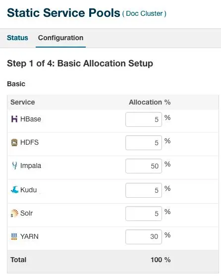
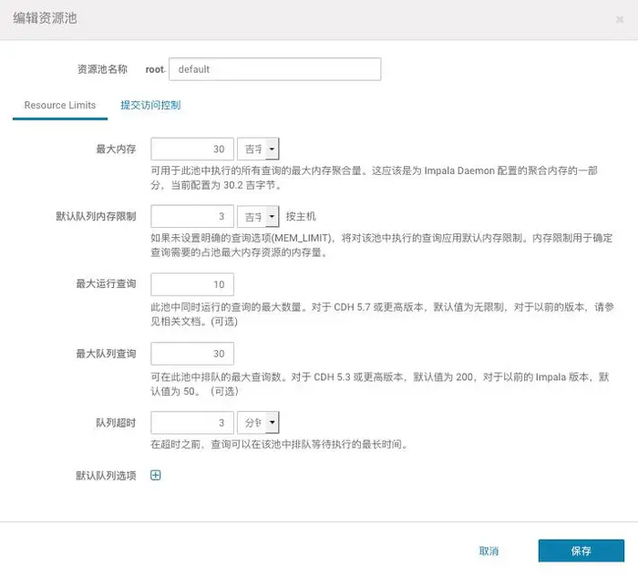
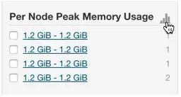
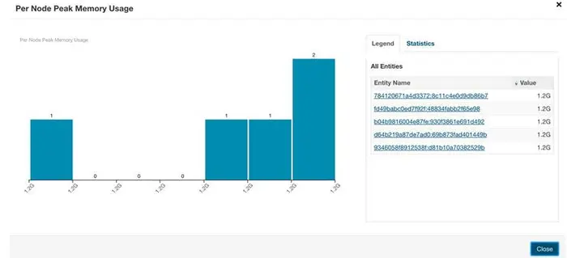
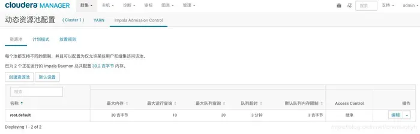

# 1.1 什么是Impala


Cloudera公司推出，提供对HDFS、HBase数据的高性能、低延迟的交互式SQL查询功能。

基于Hive，使用内存计算，兼顾数据仓库、具有实时、批处理、多并发等优点。

是CDH平台首选的PB级大数据实时查询分析引擎。


# 1.2 Impala的优缺点

## 优点

1. 基于内存运算，不需要把中间结果写入磁盘，省掉了大量的I/O开销。
2. 无需转换为Mapreduce，直接访问存储在HDFS，HBase中的数据进行作业调度，速度快。

1. 使用了支持Data locality的I/O调度机制，尽可能地将数据和计算分配在同一台机器上进行，减少了网络开销。
2. 支持各种文件格式，如TEXTFILE 、SEQUENCEFILE 、RCFile、Parquet。

1. 可以访问hive的metastore，对hive数据直接做数据分析。


## 缺点

1. 对内存的依赖大，且完全依赖于hive。
2. 实践中，分区超过1万，性能严重下降。

1. 只能读取文本文件，而不能直接读取自定义二进制文件。
2. 每当新的记录/文件被添加到HDFS中的数据目录时，该表需要被刷新。

# 1.3 Impala的架构


Impala自身包含三个模块：Impalad、Statestore(存放Hive的元数据)和Catalog(拉取真实数据)，除此之外它还依赖Hive Metastore和HDFS。


## Impalad


接受Client的请求，Query执行并返回给中心协调节点；  

子节点上的守护进程， 负责向Statestore保持通信，汇报工作。

## Catalog  


分发表的元数据信息到各个Impalad中；

接收来自Statestore的所有请求。

# Statestore


负责收集分布在集群中各个Impalad进程的资源信息、各节点健康状况，同步节点信息；  


# CM实操

## 1、静态资源和动态资源说明

| 静态资源 | 使用静态服务池可以给Impala和其他服务分配专用的资源，以考虑到预计的资源需求。静态服务池将服务彼此隔离开来，因此一个高负载的服务对其他服务的影响是有限的。你可以使用CM来配置静态服务池，控制内存，CPU和磁盘I/O。 |
| -------- | ------------------------------------------------------------ |
| 动态资源 | 池可以嵌套，它的每一个级别都可以支持不同的计划程序，如 FIFO 或 Fair Scheduler。每个池都可以配置为仅允许某些用户和组集访问该池。 |

## 2、静态资源设置

 

- HDFS通常最少需要5-10%的资源         
- 一般，Yarn和Impala分割余下的资源总量	 
- 对于绝大部分批处理负载的应用，可能需要分配Yarn的资源为60%，Impala为30%，并且HDFS为10%；	
- 对于绝大部分为Ad  hoc查询负载来说，可能需要分配Impala的资源为60%，Yarn为30%，并且HDFS为10%。 

## 3、使用准入控制

因为静态服务池的限制，你需要使用准入控制功能来更加细分Impala的资源。你可以在CM的动态资源池页面中配置Impala的准入控制池。 

 

在多租户的使用案例中，你使用准入控制划分动态资源池的使用。合理明智地分配资源可以让重要的查询更快更可靠的执行。

一个动态资源池有如下属性：

 1、最大运行查询：

​	指定资源池中，查询进入排队前的最大并发数

 2、最大内存：

​	指定资源池中，查询进入排队前的最大内存使用量

 3、默认队列内存限制：

​	每个节点给每个查询最大分配的内存使用大小，这样对于集群来说，一个查询可以使用的最大内存为MEM_LIMIT * 节点数。

 4、最大队列查询：

​	资源池中最大的排队的查询数，超过此大小的查询将被拒绝。

 5、队列超时：

​	设置排队的查询可以等待多久，超时的查询将被取消。

## 4、设置每个查询的内存限制

​	使用每个查询的内存限制是为了防止查询消耗过多的内存资源而影响其他查询。强烈建议设置查询的内存限制。         

​	如果你对一个资源池设置了“Pool Max Mem Resources”，那么查询没有足够的内存执行时，Impala将尝试压制此查询。         

​	典型的情况是，你可以使用“set  MEM_LIMIT=Xg;”查询选项来设置内存限制，具体大小的设置可以根据业务场景找到一个适合的值，这样基于内存的准入控制能够更好的工作。

​	同样也会存在潜在的缺点，就是尝试去使用更多内存的查询可能会被取消或执行效率很低。         

​	为了去寻找一个合理的默认查询内存限制：  

​		1、运行负载 

​		2、在Cloudera Manager，选择Impala > Queries  

​		3、单击“Select Attributes”  

​		4、从弹出的对话框中选择“Per Node Peak Memory Usage”（每个节点的内存使用峰值），然后点击“Update”  

​		5、允许系统时间去收集信息，然后点击“Show Histogram”图标去查看结果： 

 

​		6、 使用直方图去分析绝大部分查询语句，发现一个比较合适的内存大小。针对那些需要更多内存的查询（超过限制的内存大小），我们可以显式地设置内存限制大小以确保查询可以运行完成。 

 

## 5、动态资源池设置

​       动态资源池是用来配置及用于在池中运行的 YARN 应用程序或 Impala 查询之间安排资源的策略。动态资源池允许你基于用户访问指定池的权限，调度和分配资源给Impala的查询使用。

​       为Impala创建一个生产的动态资源池：

1、在Cloudera Manager，选择Clusters> Dynamic Resource Pool Configuration
 2、点击ImpalaAdmission Control选项
 3、 点击CreateResource Pool
 4、指定生产的资源池的名称和资源限制大小：

```shell
- 在“Resource Pool Name”中，输入“Production”
- 在“Max Memory”中，输入48000
- 在“Default Query Memory Limit“中，输入1600（每个节点）
- 在“Max Running Queries”中，输入10
- 在“Max Queued Queries”中，输入200
- 在“Queue Timeout”中，输入3（minutes）
```

5、点击Create
6、点击RefreshDynamic Resource Pools

​       对于上面的设置，生产队列中可以同时运行10个Impala查询语句。如果总的内存请求超过48000MB，它将查询放到队列中，直到内存释放，这样就阻止了运行的查询需要的内存超过可用的内存大小的情况。

**为Impala创建一个开发的动态资源池：**
 1、在Cloudera Manager，选择Clusters> Dynamic Resource Pool Configuration
 2、点击ImpalaAdmission Control选项
 3、点击CreateResource Pool
 4、 指定开发的资源池的名称和资源限制大小

```shell
- “Resource Pool Name”中，输入“Development”
- 在“Max Memory”中，输入24000
- 在“Default Query Memory Limit“中，输入8000
- 在“Max Running Queries”中，输入1
- 在“Max Queued Queries”中，输入100
- 在“Queue Timeout”中，输入2（minutes）
```

5、 点击Create

6、点击RefreshDynamic Resource Pools

## 6、关于放置规则

​       放置规则决定了每个查询如何映射到一个资源池中。标准的设置是当指定时就使用一个指定的资源池，否则使用默认的资源池。

​       比如，你可以使用SET语句设置使用哪一个资源池用来查询语句：

​       SET REQUEST_POOL=Production;

## 7、设置资源池上的权限控制

​       你可以指定哪些用户和组可以被允许去使用创建好的资源池。

​       为Impala创建一个开发的动态资源池：

1、 在Cloudera Manager中，选择集群> 动态资源池配置
 2、点击Impala Admission Control 选项
 3、选择[创建资源池]，点击Edit按钮修改

 

4、点击SubmissionAccess Control 选项  

5、选择Allowthese users and groups to submit to this pool  

6、以逗号分隔，输入用户列表，指定这些用户访问指定的资源池 

 

7、 点击Save 