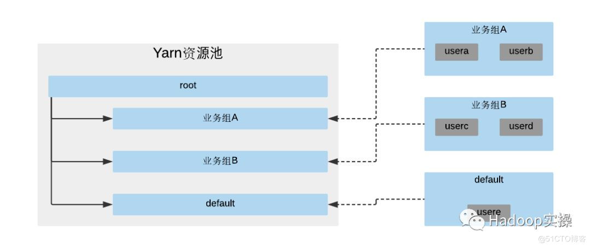
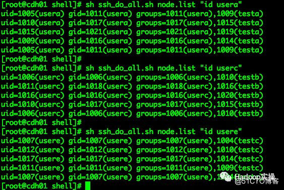
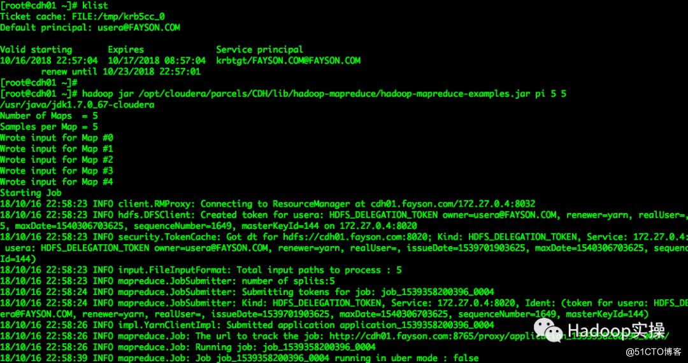
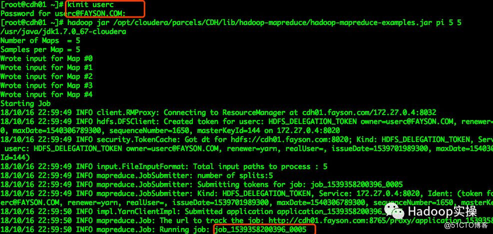
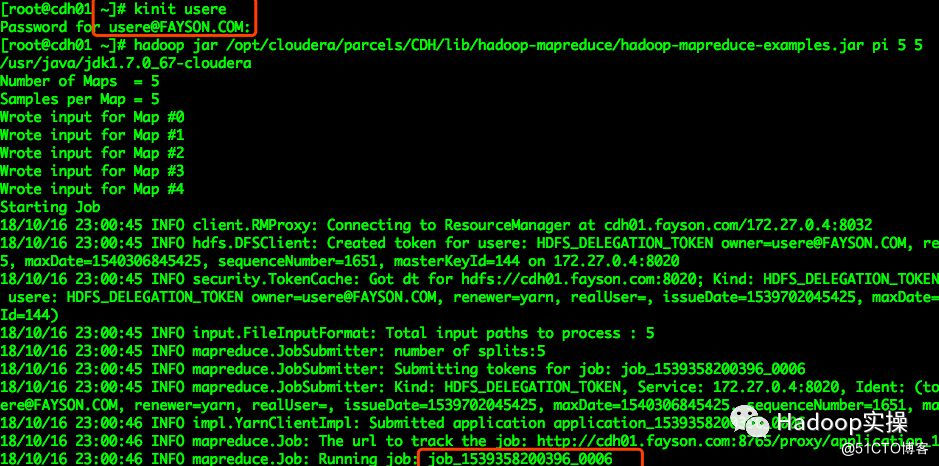
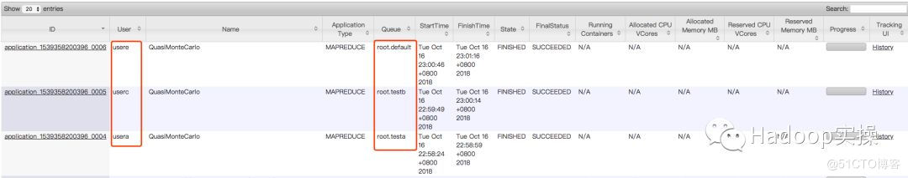

# 一、基础组件


## ResourceManager（RM）

负责对各个NodeManager 上的资源进行统一管理和调度。包含两个组件：

- Scheduler：调度器根据容量、队列等限制条件（如每个队列分配一定的资源，最多执行一定数量的作业等），将系统中的资源分配给各个正在运行的应用程序
- Applications Manager：应用程序管理器负责管理整个系统中所有应用程序，包括应用程序提交、与调度器协商资源以启动ApplicationMaster、监控ApplicationMaster运行状态并在失败时重新启动它等

## NodeManager（NM）

NM 是每个节点上的资源和任务管理器。

- 定时地向RM 汇报本节点上的资源使用情况和各个Container 的运行状态
- 接收并处理来自AM 的Container启动/ 停止等各种请求

## ApplicationMaster（AM）

用户提交的每个应用程序均包含一个AM，主要功能包括：

- 与RM 调度器协商以获取资源（用 Container 表示）
- 将得到的任务进一步分配给内部的任务

- 与 NM 通信以启动 / 停止任务
- 监控所有任务运行状态，并在任务运行失败时重新为任务申请资源以重启任务

## Container

Container 是YARN 中的资源抽象， 它封装了某个节点上的多维度资源， 如内存、CPU、磁盘、网络等，当AM 向RM 申请资源时，RM 为AM 返回的资源便是用Container表示的。


# 二、运行机制

## 2.1 运行时图

1. 用户向YARN中提交应用程序，包括AM、AM 启停指令脚本、用户程序。
2. ResourceManager为该应用程序分配第一个Container，并与对应的NodeManager通信，要求它在这个Container中启动应用程序的AM。

3. AM首先向ResourceManager注册，以便ResourceManager查看应用程序的运行状态，为各个任务申请资源，监控运行状态，直到运行结束。

4. 1. AM采用轮询的方式通过RPC协议向ResourceManager申请和领取资源。
   2. AM申请到资源后，与对应的NodeManager通信，要求它启动任务。

5. 1. NodeManager为任务设置好运行环境（环境变量、JAR包、二进制程序），将任务启动命令写到一个脚本中，通过该脚本启动任务。
   2. 各个任务通过RPC协议向AM汇报自己的状态和进度，以便让AM随时掌握各个任务的运行状态，从而可以在任务失败时重启任务。

6. 应用程序运行完成后，AM向ResourceManager注销并关闭自己。 


## 2.2 内部机制

### YARN核心服务

- Resource Manager 管理资源
- Node Manager 运行在集群所有节点上的启动和监控容器的，容器是用于执行特定的应用的程序的进程，每个容器有资源限制，详细可以配置（如内存、CPU等）。

### YARN启动

```
客户端向资源管理器发送一个请求，要求其运行一个Application Master，资源管理器（Resource Manager）便在集群容器中找到一个能运行Application Master的节点管理器，Application Master启动后将要做什么由其自己决定，可向资源管理器请求更多的容器或在所处的容器中进行一个简单的计算并将结果返回给客户端（而各个进程或节点间的通信是由hadoop RPC提供的，YARN本身不提供通信机制，但是YARN有API，可一般不调用，基本用更高级的如MapReduce的API）。
```

### AM向YARN申请资源

​	YARN的资源请求遵从优先最近原则，既本节点为首要选择，其次为本机架，如再不满足可取本集群任意节点。YARN的资源请求可在任意时刻提出，既动态申请。理想情况下，YARN的资源申请应立即给予满足，但由于现实情况下资源有限所以一个应用请求资源经常需要进行等待，这就涉及到YARN的资源调度方式，调度方式的区别决定了资源请求的速度。

### YARN资源调度

资源调度的方式通常有三种：FIFO调度器，容器调度器、公平调度器

  

# 三、放置规则

​	Hadoop集群管理员希望能对集群YARN作业的资源进行控制。根据不同的业务组或不同的用户，对Yarn的资源池进行划分，达到资源管控、任务管控的效果。通过CM可以进行YARN动态资源的配置，这里主要介绍如何在Cloudera Manager中配置YARN动态资源池的放置规则。

​	在这里主要用一个场景进行描述，在不给作业指定资源池的情况下，通过CM的放置策略将不同的用户提交的作业自动分配到指定的资源池中。

## 1.测试环境描述

 

## 2.场景描述

 

​	实例场景如下：当前CDP集群供多个业务部门使用，在YARN中为不同的业务组划分不同的资源池，对应业务组的用户作业需要自动的提交到划分的资源池中。如下图所示：

 

通过上图可以看到有YARN的资源池中创建3个队列：业务组A、业务组B、default。右边有多个业务组的用户，在用户提交作业时需要根据用户所在的也业务组不同自动为用户分配不通的资源池，接下来通过具体的YARN动态资源池放置规则的配置进行实现。

 

## 3.测试用户准备

 

在配置前先准备三个测试用户usera、userc和usere，三个用户的组分别为groupa、testb、testc。

1. CDP集群的所有节点创建testa、testb、testc三个组，testa表示“业务组A”、testb表示“业务组B”、testc不属于任何业务组。

    [root@cdh01 shell]# sh ssh_do_all.sh node.list "groupadd testa"
    [root@cdh01 shell]# sh ssh_do_all.sh node.list "groupadd testb"
    [root@cdh01 shell]# sh ssh_do_all.sh node.list "groupadd testc"


2. 在集群所有节点创建usera、userc、usere三个用户

    [root@cdh01 shell]# sh ssh_do_all.sh node.list "useradd usera"
    [root@cdh01 shell]# sh ssh_do_all.sh node.list "useradd userc"
    [root@cdh01 shell]# sh ssh_do_all.sh node.list "useradd usere"

3. 将usera添加groupa组，userc添加groupb组，usere添加groupc组

    sh ssh_do_all.sh node.list "usermod -a -G testa usera"
    sh ssh_do_all.sh node.list "usermod -a -G testb userc"
    sh ssh_do_all.sh node.list "usermod -a -G testc usere"

 

4. 验证创建的测试用户是否已添加到对应的业务组中

  

## 4.YARN动态资源池配置

​	根据上述的需求场景，这里需要修改默认Yarn资源池配置，将资源池按照上面的业务组进行创建，在root根资源池下面分别创建testa、testb、default三个资源池。

- 使用管理员登录CM，进入Yarn动态资源池管理界面

- 删除默认的资源池配置，将资源池配置为如下

注意：资源池的名称需要与业务组的名称一致，否则会导致用户不能匹配到相应的资源池。

 

## 5. 放置规则设置

在上一步完成的资源池的配置，并没有进行放置规则的配置，如果使用默认的放置规则，usera、userc、usere用户提交的作业均会被分配到default池，接下来需要进行放置规则的配置。

 

1.在Yarn的动态资源池配置界面点击菜单“放置规则”，进入配置界面

 

2.将默认的放置规则删除，添加新的放置规则，三条规则分别如下：

 

- 规则一：“root.[pool name]”
- 规则二：“root.[secondary group]”
- 规则三：“已在运行时指定”，取消勾选“池不存在时创建池“

 

3.创建完成后的放置规则顺序如下：

 

关于放置规则类型的解释说明：

- root.[pool name]:该规则始终满足，在其它规则不匹配的情况下使用，因此该规则默认要放置在所有匹配规则之后。

- root.[pool name].[username]：该放置规则会判断资源池中是否存在相应的pool name，存在则在该资源池下创建与用户名相同的资源池（勾选池不存在时创建池的情况下）。

- root.[primary group]：该放规则使用与该用户主要组匹配的资源池。Linux中用户默认的主要组与用户名一致，匹配时会通过用户的主要组与资源池名称比对。

- root.[primary group].[username]：该放置规则会优先使用用户的主要组匹配的资源池，然后使用与该用户名匹配的子池，如果勾选池不存在时创建池则会在该池下创建一个与用户名一致的子池。

- root.[secondarygroup]：该放置规则用于匹配用户的次要组，使用与次要组之一匹配的资源池。

- root.[secondarygroup].[username]：该放置规则首先匹配用户的次要组，然后使用与该用户名匹配的资源池。

- root.[username]:该放置规则用于匹配与用户名一致的资源池。（不推荐使用）
- 自已在运行时指定：该放置规则主要使用在运行时指定的资源池。

 

放置规则的判断方式，根据放置规则的顺序1、2、3…进行判断，判断到满足条件的放置规则后，后续的规则不再进行匹配。

 

## 6.验证 放置规则

 

分别使用usera、userc、usere三个用户向集群提交作业，根据上述规则的设置，usera用户提交的作业回到groupa资源池，userc用户提交的作业会到groupb资源池，userc用户提交的作业会到default资源池。如下为作业提交脚本：

    [root@cdh01 ~]# hadoop jar /opt/cloudera/parcels/CDH/lib/hadoop-mapreduce/hadoop-mapreduce-examples.jar pi 

1.使用usera向集群提交作业

  


2.使用userc向集群提交MR作业

  

 

3.使用usere向集群提交MR作业

 

 

4.在CM和Yarn的8088界面上查看三个用户作业所分配的资源池

 

  

## 7.总结

- 通过配置放置规则的方式可以将不同用户或不同业务的作业划分到指定的资源池中，在示例中使用了Secondary Group放置规则来划分用户作业所属资源池。

- 在Secondary Group放置规则中，用户除了主要组外其他组均为次要组，都可以走Secondary Group的放置策略。