领域驱动设计DDD是一段时间以来比较流行的概念，刚开始接触时觉得概念很多，并且比较难以落地。本文就来分析探讨DDD落地时需要关注的六个问题，并通过一个足球运动员信息管理系统案例分析落地的六个步骤。

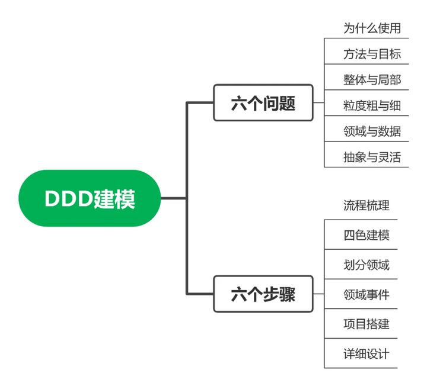

## **1 六个问题**

**1.1 为什么使用**

DDD方法论的核心是将问题不断分解，把大问题分解为小问题，大业务分解小领域，简而言之就是分而治之，各个击破。[分而治之](https://www.zhihu.com/search?q=%E5%88%86%E8%80%8C%E6%B2%BB%E4%B9%8B&search_source=Entity&hybrid_search_source=Entity&hybrid_search_extra=%7B%22sourceType%22%3A%22answer%22%2C%22sourceId%22%3A2008419558%7D)是指直接面对大业务我们无从下手，需要按照一定方法进行分解，分解为高内聚的小领域，使得业务有边界清晰，而这些小领域是我们有能力处理的，这就是领域驱动设计的核心。各个击破是指当问题被拆分为小领域后，因为小领域业务内聚，其子领域高度相关，我们在技术维度可以对其进行详细设计，在管理维度可以按照领域对项目进行分工。需要指出DDD不能替代详细设计，DDD是为了更清晰地详细设计。在微服务流行的互联网行业，当业务逐渐复杂时，技术人员需要解决如何划分微服务边界的问题，DDD这种清晰化业务边界的特性正好可以用来解决这个问题。


**1.2 方法与目标** 

我们的目标是将业务划分清晰的边界，而DDD是达成目标的有效方法之一，这一点是需要格外注意的。DDD是方法不是目标，不需要为了使用而使用。例如业务模型比较简单可以很容易分析的业务就不需要使用DDD，还有一些目标是快速验证类型的项目，追求短平快，前期可能也不需要使用[领域驱动设计](https://www.zhihu.com/search?q=%E9%A2%86%E5%9F%9F%E9%A9%B1%E5%8A%A8%E8%AE%BE%E8%AE%A1&search_source=Entity&hybrid_search_source=Entity&hybrid_search_extra=%7B%22sourceType%22%3A%22answer%22%2C%22sourceId%22%3A2008419558%7D)

 **1.3 整体与局部**

领域可以划分多个子领域，子域可以再划分多个子子域，限界上下文本质上也是一种子子域，那么在业务分解时一个业务模块到底是领域、[子域](https://www.zhihu.com/search?q=%E5%AD%90%E5%9F%9F&search_source=Entity&hybrid_search_source=Entity&hybrid_search_extra=%7B%22sourceType%22%3A%22answer%22%2C%22sourceId%22%3A2008419558%7D)还是子子域？我认为不用纠结在这个问题，因为这取决于看待这个模块的角度。你认为整体可能是别人的局部，你认为的局部可能是别人的整体，叫什么名字不重要，最重要的是按照高内聚的原则将业务高度相关的模块收敛在一起。 

 **1.4 粒度粗与细**

业务划分粒度的粗细并没有统一的标准，还是要根据业务需要、开发资源、技术实力等因素综合考量。例如微服务拆分过细反而会增加开发、部署和维护的复杂度，但是拆分过粗可能会导致大量业务高度耦合，开发部署起来是挺快的，但是缺失可维护性和可扩展性，这需要根据实际情况做出权衡。

**1.5 领域与数据**

领域对象与数据对象一个重要的区别是值对象存储方式。在讨论领域对象和数据对象之前，我们首先讨论实体和值对象这一组概念。实体是具有唯一标识的对象，而唯一标识会伴随实体对象整个生命周期并且不可变更。值对象本质上是属性的集合，并没有唯一标识。

领域对象在包含值对象的同时也保留了值对象的业务含义，而数据对象可以使用更加松散的结构保存值对象，简化数据库设计。

现在假设我们需要管理足球运动员信息，对应的领域模型和数据模型应该如何设计？姓名、身高、体重是一名运动员本质属性，加上唯一编号可以对应实体对象。跑动距离，传球成功率，进球数是运动员比赛中的表现，这些属性的集合可以对应值对象。

值对象在数据对象中可以用松散的数据结构进行存储，而值对象在领域对象中需要保留其业务含义如下图所示：

 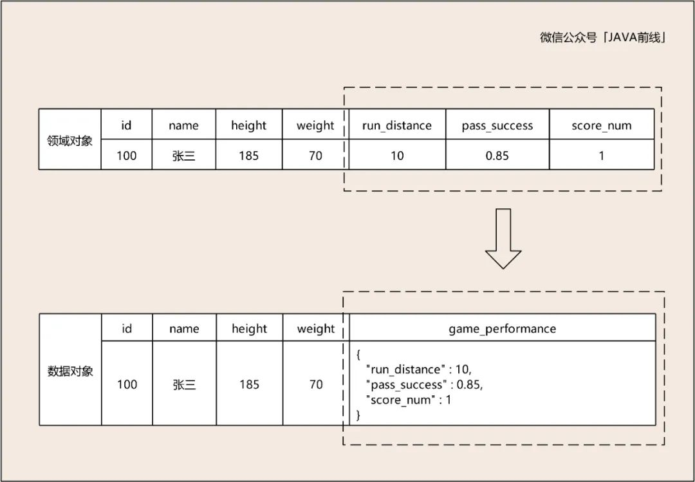 

 根据图示编写领域对象与数据对象代码： 


 ```java
// 数据对象
public class FootballPlayerDO {
    private Long id;
    private String name;
    private Integer height;
    private Integer weight;
    private String gamePerformance;
}

// 领域对象
public class FootballPlayerDMO {
    private Long id;
    private String name;
    private Integer height;
    private Integer weight;
    private GamePerformanceVO gamePerformanceVO;
}

public class GamePerformanceVO {
    private Double runDistance;
    private Double passSuccess;
    private Integer scoreNum;
}
 ```

**1.6 抽象与灵活**

抽象的核心是找相同，对不同事物提取[公因式](https://www.zhihu.com/search?q=%E5%85%AC%E5%9B%A0%E5%BC%8F&search_source=Entity&hybrid_search_source=Entity&hybrid_search_extra=%7B%22sourceType%22%3A%22answer%22%2C%22sourceId%22%3A2008419558%7D)。实现的核心是找不同，扩展各自的属性和特点，体现了灵活性。例如模板方法设计模式正是用抽象构建框架，用实现扩展细节。我们再回到数据模型的讨论，可以发现脚本化是一种拓展灵活性的方式，脚本化不仅指使用groovy、QLExpress脚本增强系统灵活性，还包括松散可扩展的数据结构。数据模型抽象出了姓名、身高、体重这些基本属性，对于频繁变化的比赛表现属性，这些属性值可能经常变化，甚至属性本身也是经常变化，例如可能会加上射门次数，突破次数等，所以采用松散的JSON数据结构进行存储。 

  **2 六个步骤**

工程理论总是要落地的，落地也是需要一些步骤和方法的。本文我们一起分析一个足球运动员信息管理系统，目标是管理运动员从转会到上场比赛整条链路信息，这个系统大家应该也都没有接触过，我们一起来分析。需要说明本实例着重演示DDD方法论如何落地，业务细节可能并不能面面俱到。

 **2.1 流程梳理**

梳理流程有两个问题需要考虑，第一个问题是从什么视角去梳理？因为不同的人看到的流程是不一样的。答案是取决于系统需要解决的是什么问题，因为我们要管理运动员从转会到上场比赛整条链路信息，所以从运动员视角出发是一个合适的选择。

第二个问题是对业务不熟悉怎么办？因为我们不是体育和运动专家，并不清楚整条链路的业务细节。答案是梳理流程时一定要有业务专家在场，因为没有真实业务细节，无法领域驱动设计。同理在互联网梳理复杂业务流程时，一定要有对相关业务熟悉的产品经理或者运营一起参与。

假设足球业务专家梳理出了业务流程，运动员提出转会，协商一致后到新俱乐部体检，体检通过就进行签约。进入新俱乐部后进行训练，训练指标达标后上场比赛，赛后参加新闻发布会。

 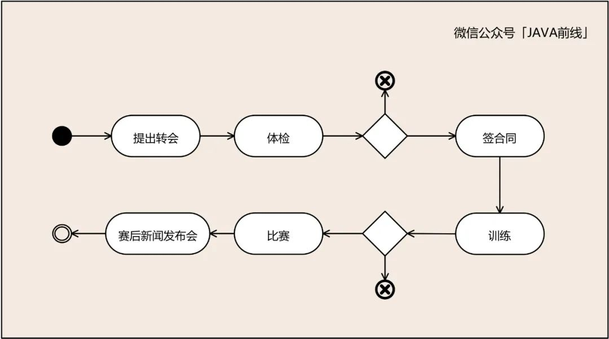 

 **2.2 四色建模** 

### **(1) 时标对象**

四色建模第一种颜色是红色，表示时标对象。时标对象是四色建模最重要的对象，可以理解为核心业务单据。在业务进行过程中一定要对关键业务留下单据，通过这些单据可以追溯出整个业务流程。

时标对象具有两个特点：第一是事实不可变性，记录了过去某个时间点或时间段内发生的事实。第二是责任可追溯性，记录了管理者关注的信息。现在我们分析本系统时标对象有哪些，需要留下哪些核心业务单据。

转会对应转会单据，体检对应体检单据，签合同对应合同单据，训练对应训练指标单据，比赛对应比赛指标单据，新闻发布会对应采访单据。根据分析绘制如下时标对象：

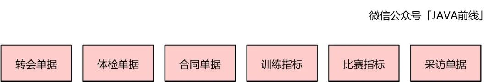 


 **(2) 参与方、地、物**

这三类对象在四色建模中用绿色表示，我们以电商场景为例进行说明。用户支付购买商家的商品时，用户和商家是参与方。物流系统发货时配送单据需要有配送地址对象，地址对象就是地。订单需要商品对象，物流配送需要有货品，商品和货品就是物。

我们分析本例可以知道参与方包含总经理、队医、教练、球迷、记者，地包含训练地址、比赛地址、采访地址，物包含签名球衣和签名足球：

 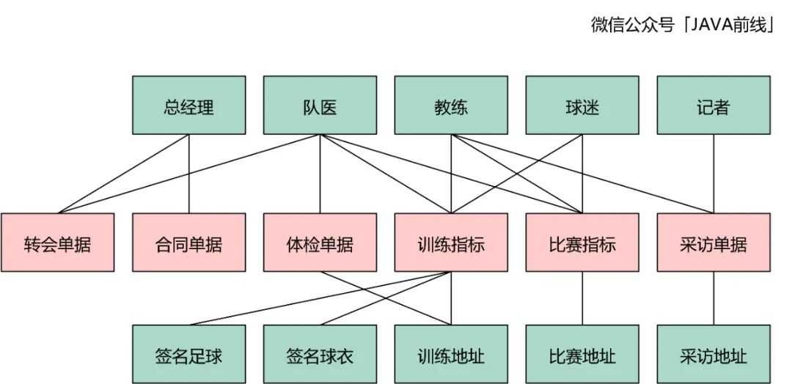 

 

 **(3) 角色对象** 

在四色建模中用黄色表示，这类对象表示参与方、地、物是以什么角色参与到业务流程： 

 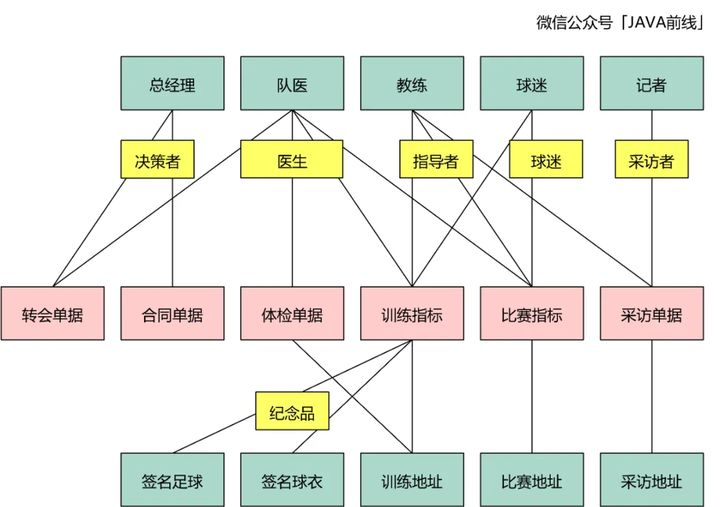 

 

 **(4) 描述对象** 

我们可以为对象增加相关描述信息，在四色建模中用蓝色表示： 

 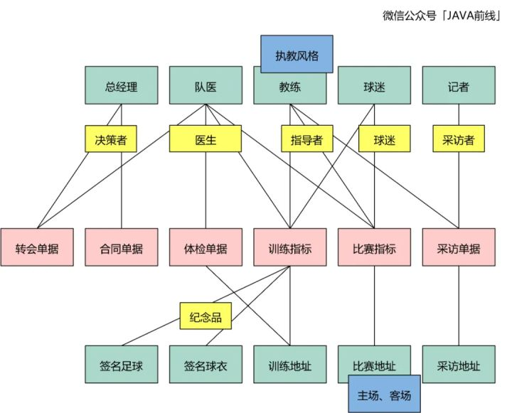 

 **2.3 划分领域** 

在四色建模过程中我们体会到时标对象是最重要的对象，因为其承载了业务系统核心单据。在划分领域时我们同样离不开时标对象，通过收敛相关时标对象划分领域。 

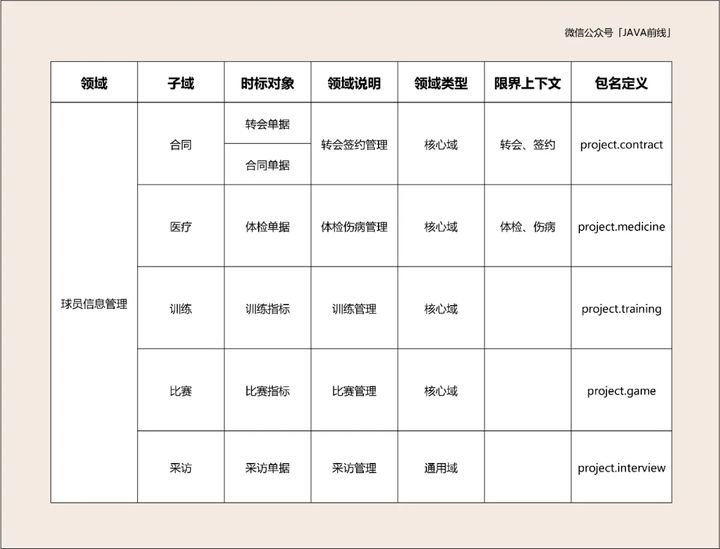 

 **2.4 领域事件** 

当业务系统发生一件事情时，如果本领域或其它领域有后续动作跟进，那么我们把这件事情称为领域事件，这个事件需要被感知。

例如球员比赛受伤了，这是比赛子域事件，但是医疗和训练子域是需要感知的，那么比赛子域就发出一个事件，医疗和训练子域会订阅。

例如球员比赛取得进球，这也是比赛子域事件，但是训练和合同子域也会关注这个事件，所以比赛子域也会发出一个比赛进球事件，训练和合同子域会订阅。

通过事件交互有一个问题需要注意，通过事件订阅实现业务只能采用最终一致性，需要放弃强一致性，这一点可能会引入新的复杂度需要权衡。

 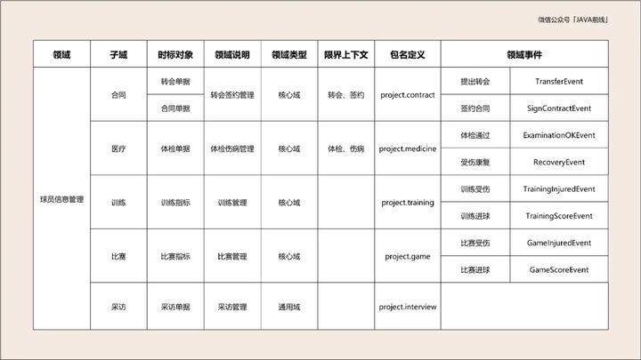 

 **2.5 项目搭建** 

### **(1) api**

接口层：提供面向外部接口声明和DTO对象

### **(2) controller**

访问层：提供HTTP访问入口

### **(3) service**

业务层：领域层和业务层都包含业务，但是用途不同。业务层可以组合不同领域业务，并且可以增加流控、监控、日志、权限控制切面，相较于领域层更为丰富，提供BO对象

### **(4) domain**

领域层：提供DMO（DomainObject）、VO、事件、数据访问对象，核心是按照领域进行分包，领域内高内聚，领域间低耦合

### **(5) dependency**

外部访问层：在这个模块中调用外部RPC服务，解析返回码和返回数据

### **(6) infrastructure**

基础层：包含基础功能，例如缓存工具，消息队列，分布式锁，消息发送等功能

 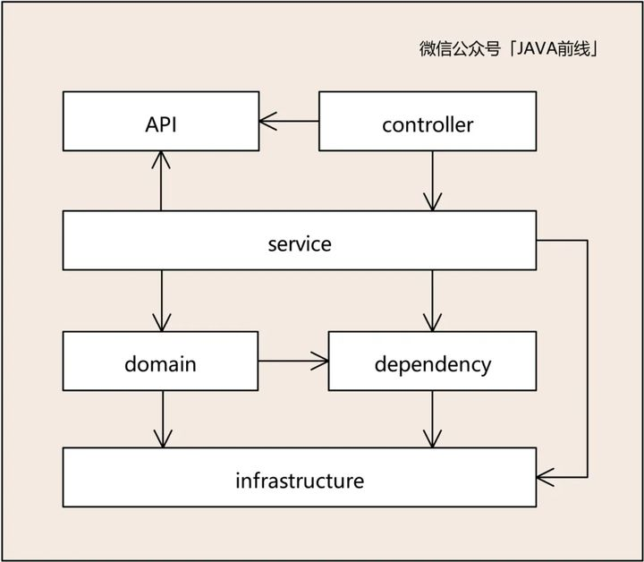 

 

 我们展开领域层进行分析。领域层的核心是按照领域进行分包，并且提供DMO、VO、事件、数据访问对象，领域内高内聚，领域间低耦合，例如domain1对应合同子域，domain2对应训练子域，domain3对应合同子域。 

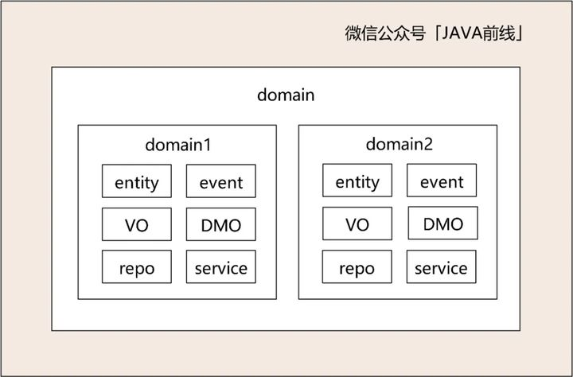 

 

 **2.6 详细设计**

目前为止领域已经确定了，现在可以根据领域划分任务了，组内成员分别负责一个或多个领域进行详细设计，这个阶段就是大家非常熟悉的用例图，活动图，时序图，数据库设计，接口设计的用武之地。需要说明的是领域驱动设计不是取代详细设计，而是为了更清晰地详细设计。

 **3 文章总结**

本文探讨了DDD落地时需要关注的六个问题，并通过一个足球运动员信息管理系统案例落地了六个步骤。在实际应用中各业务形态千差万别，但是方法论却可以通用，我们需要明确DDD核心是分而治之各个击破，并配合一些经过检验的有效方法进行建模，希望本文对大家有所帮助。

 

 

 

 

 

 

 

 

 

 