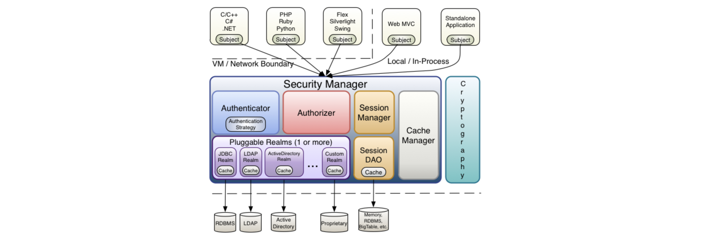
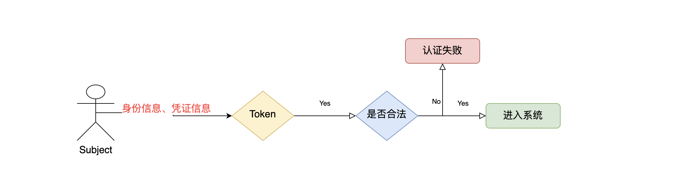

# 1、权限的管理

## 1.1 什么是权限管理

​	基本上涉及到用户参与的系统都要进行权限管理，权限管理属于系统安全的范畴，权限管理实现对用户访问系统的控制，按照安全规则或者安全策略控制用户可以访问而且只能访问自己被授权的资源。

​	权限管理包括用户身份认证和授权两部分，简称认证授权。对于需要访问控制的资源用户首先经过身份认证，认证通过后用户具有该资源的访问权限方可访问。

## 1.2 什么是身份认证

​	身份认证，就是判断一个用户是否为合法用户的处理过程。最常用的简单身份认证方式是系统通过核对用户输入的用户名和口令，看其是否与系统中存储的该用户的用户名和口令一致，来判断用户身份是否正确。对于采用指纹等系统，则出示指纹；对于硬件Key等刷卡系统，则需要刷卡。

## 1.3 什么是授权

授权，即访问控制，控制谁能访问哪些资源。主体进行身份认证后需要分配权限方可访问系统的资源，对于某些资源没有权限是无法访问的

# 2.什么是shiro

​	Shiro 是一个功能强大且易于使用的Java安全框架，它执行身份验证、授权、加密和会话管理。使用Shiro易于理解的API，您可以快速轻松地保护任何应用程序—从最小的移动应用程序到最大的web和企业应用程序。

​	Shiro是apache旗下一个开源框架，它将软件系统的安全认证相关的功能抽取出来，实现用户身份认证，权限授权、加密、会话管理等功能，组成了一个通用的安全认证框架。

# 3.Shiro的核心构架

 

## 3.1 Subject

​	Subject即主体，外部应用与subject进行交互，subject记录了当前操作用户，将用户的概念理解为当前操作的主体，可能是一个通过浏览器请求的用户，也可能是一个运行的程序。

​	Subject在shiro中是一个接口，接口中定义了很多认证授相关的方法，外部程序通过subject进行认证授，而subject是通过SecurityManager安全管理器进行认证授权

## 3.2 SecurityManager

​	SecurityManager即安全管理器，对全部的subject进行安全管理，它是shiro的核心，负责对所有的subject进行安全管理。通过SecurityManager可以完成subject的认证、授权等，实质上SecurityManager是通过Authenticator进行认证，通过Authorizer进行授权，通过SessionManager进行会话管理等。

SecurityManager是一个接口，继承了Authenticator, Authorizer, SessionManager这三个接口。

## 3.3 Authenticator

Authenticator即认证器，对用户身份进行认证，Authenticator是一个接口，shiro提供ModularRealmAuthenticator实现类，通过ModularRealmAuthenticator基本上可以满足大多数需求，也可以自定义认证器。

## 3.4 Authorizer

Authorizer即授权器，用户通过认证器认证通过，在访问功能时需要通过授权器判断用户是否有此功能的操作权限。

## 3.5 Realm

​	Realm即领域，相当于datasource数据源，securityManager进行安全认证需要通过Realm获取用户权限数据，比如：如果用户身份数据在数据库那么realm就需要从数据库获取用户身份信息。

​ 注意：不要把realm理解成只是从数据源取数据，在realm中还有认证授权校验的相关的代码。

## 3.6 SessionManager

​	sessionManager即会话管理，shiro框架定义了一套会话管理，它不依赖web容器的session，所以shiro可以使用在非web应用上，也可以将分布式应用的会话集中在一点管理，此特性可使它实现单点登录。

## 3.7 SessionDAO

SessionDAO即会话dao，是对session会话操作的一套接口，比如要将session存储到数据库，可以通过jdbc将会话存储到数据库。

## 3.8 CacheManager

CacheManager即缓存管理，将用户权限数据存储在缓存，这样可以提高性能。

## 3.9 Cryptography

Cryptography即密码管理，shiro提供了一套加密/解密的组件，方便开发。比如提供常用的散列、加/解密等功能。

# 4.shiro中的认证

## 4.1 认证

身份认证，就是判断一个用户是否为合法用户的处理过程。最常用的简单身份认证方式是系统通过核对用户输入的用户名和口令，看其是否与系统中存储的该用户的用户名和口令一致，来判断用户身份是否正确。

## 4.2 shiro中认证的关键对象

    Subject：主体
    访问系统的用户，主体可以是用户、程序等，进行认证的都称为主体；
    
    Principal：身份信息
    是主体（subject）进行身份认证的标识，标识必须具有唯一性，如用户名、手机号、邮箱地址等，一个主体可以有多个身份，但是必须有一个主身份（Primary Principal）。
    
    credential：凭证信息
    是只有主体自己知道的安全信息，如密码、证书等。
## 4.3 认证流程

 

## 4.4 认证的开发

### 1 引入依赖

```xml
 <dependency>
    <groupId>org.apache.shiro</groupId>
    <artifactId>shiro-core</artifactId>
    <version>1.5.1</version>
</dependency>
```

### 2 shiro.ini文件数据源

> ini文件入门结构参考:
>
>     [users]部分: 提供了对用户/密码及其角色的配置，格式如 ‘用户名=密码，角色1，角色2’
>     
>     [roles]部分: 提供了角色及权限之间关系的配置，格式如 '角色=权限1，权限2‘
>     
>     [urls]部分: 用于web，提供了对web url拦截相关的配置，格式如 ‘url=拦截器[参数]，拦截器’

```
# 定义用户, 格式: ‘用户名=密码，角色1，角色2’
[users]
zs = 12345, admin 
ls = 12345, productManager
wmz = 12345, orderManager
# 定义角色, 格式: '角色=权限1，权限2‘
[roles]
admin = *
productManager = addProduct,deleteProduct,editProduct,updateProduct,listProduct
orderManager = addOrder,deleteOrder,editOrder,updateOrder,listOrder
```

 #### 加载ini文件成数据源

```java
//加载配置文件，并获取工厂
DefaultSecurityManager defaultSecurityManager = new DefaultSecurityManager();
//通过配置文件生成数据源
IniRealm iniRealm = new IniRealm("classpath:shiro.ini");
defaultSecurityManager.setRealm(iniRealm);
//将安全管理者放入全局对象
SecurityUtils.setSecurityManager(defaultSecurityManager);
```

> SecurityUtils提供全局三个静态方法
>
> - getSubject() : 可以获得当前的Subject
> - setSecurityManager(SecurityManager securityManager)
> - getSecurityManager()

####  测试入门demo

```java
package com.xiao.auth;

import org.apache.shiro.SecurityUtils;
import org.apache.shiro.authc.UnknownAccountException;
import org.apache.shiro.authc.UsernamePasswordToken;
import org.apache.shiro.mgt.DefaultSecurityManager;
import org.apache.shiro.realm.text.IniRealm;
import org.apache.shiro.subject.Subject;
import org.junit.Test;

import java.util.ArrayList;
import java.util.Arrays;

public class ShiroSimpleTest {

    @Test
    public void test() {
        // 1.创建安全管理器对象
        DefaultSecurityManager securityManager = new DefaultSecurityManager();
        // 2.给安全管理器对象设置realm数据源
        securityManager.setRealm(new IniRealm("classpath:shiro.ini"));
        // 3.SecurityUtils给全局安全工具类设置安全管理器
        SecurityUtils.setSecurityManager(securityManager);
        // 4.全局安全工具类通过安全管理者生成Subject对象
        Subject subject = SecurityUtils.getSubject();
        // 5.创建令牌
        String username = "xiao";
        UsernamePasswordToken token = new UsernamePasswordToken(username, "123456");
        try {
            System.out.println("认证状态" + subject.isAuthenticated());
            // 6. 登录
            subject.login(token);
            System.out.println("认证状态" + subject.isAuthenticated());

            // 7. 是否具有某个角色
            String role1 = "role1";
            String role2 = "role2";

            ArrayList<String> roles = new ArrayList<>();
            roles.add(role1);
            roles.add(role2);

            System.out.println(
                    String.format("用户【%s】具有【%s】角色？" + subject.hasRole(role1), username, role1));
            System.out.println(
                    String.format("用户【%s】具有【%s】角色？" + subject.hasRole(role2), username, role2));
            System.out.println(
                    String.format("用户【%s】具有【%s】角色？" + Arrays.toString(subject.hasRoles(roles)), username, roles));

            // 8. 是否具有某个权限
            String addProject = "addProject";
            String updateProject = "updateProject";
            String deleteProject = "deleteProject";
            String queryProject = "queryProject";

            System.out.println(
                    String.format("用户【%s】具有【%s】权限？" + subject.isPermitted(addProject), username, addProject));
            System.out.println(
                    String.format("用户【%s】具有【%s】权限？" + subject.isPermitted(updateProject), username, updateProject));
            System.out.println(
                    String.format("用户【%s】具有【%s】权限？" + subject.isPermitted(deleteProject), username, deleteProject));
            System.out.println(
                    String.format("用户【%s】具有【%s】权限？" + subject.isPermitted(queryProject), username, queryProject));

        } catch (UnknownAccountException e) {
            System.out.println("认证失败，用户名不存在");
            e.printStackTrace();
        } catch (Exception e) {
            e.printStackTrace();
            System.out.println("认证失败");
        }
    }

}
```

### 3 数据库支持

#### 创建相关表，初始化数据

```sql
DROP DATABASE IF EXISTS shallwe;
CREATE DATABASE shallwe DEFAULT CHARACTER SET utf8mb4;
USE shallwe;

drop table if exists user;
drop table if exists role;
drop table if exists permission;
drop table if exists user_role;
drop table if exists role_permission;

create table user (
  id bigint auto_increment,
  username varchar(100),
  password varchar(100),
  salt varchar(100),
  constraint pk_users primary key(id)
) charset=utf8mb4 ENGINE=InnoDB;

create table role (
  id bigint auto_increment,
  name varchar(100),
  constraint pk_roles primary key(id)
) charset=utf8mb4 ENGINE=InnoDB;

create table permission (
  id bigint auto_increment,
  name varchar(100),
  constraint pk_permissions primary key(id)
) charset=utf8mb4 ENGINE=InnoDB;

create table user_role (
  user_id bigint,
  role_id bigint,
  constraint pk_users_roles primary key(user_id, role_id)
) charset=utf8mb4 ENGINE=InnoDB;

create table role_permission (
  role_id bigint,
  permission_id bigint,
  constraint pk_roles_permissions primary key(role_id, permission_id)
) charset=utf8mb4 ENGINE=InnoDB;

INSERT INTO `user` VALUES (1,'admin','admin','salt');
INSERT INTO `user` VALUES (2,'xiao','123456','salt');
INSERT INTO `user` VALUES (3,'jian','123456','salt');

INSERT INTO `role` VALUES (1,'admin');
INSERT INTO `role` VALUES (2,'ProjectManager');
INSERT INTO `role` VALUES (3,'UserManager');

INSERT INTO `user_role` VALUES (1,1);
INSERT INTO `user_role` VALUES (2,2);
INSERT INTO `user_role` VALUES (3,3);

INSERT INTO `permission` VALUES (1,'addProject');
INSERT INTO `permission` VALUES (2,'deleteProject');
INSERT INTO `permission` VALUES (3,'editProject');
INSERT INTO `permission` VALUES (4,'updateProject');
INSERT INTO `permission` VALUES (5,'listProject');
INSERT INTO `permission` VALUES (6,'addUser');
INSERT INTO `permission` VALUES (7,'deleteUser');
INSERT INTO `permission` VALUES (8,'editUser');
INSERT INTO `permission` VALUES (9,'updateUser');
INSERT INTO `permission` VALUES (10,'listUser');

INSERT INTO `role_permission` VALUES (1,1);
INSERT INTO `role_permission` VALUES (1,2);
INSERT INTO `role_permission` VALUES (1,3);
INSERT INTO `role_permission` VALUES (1,4);
INSERT INTO `role_permission` VALUES (1,5);
INSERT INTO `role_permission` VALUES (1,6);
INSERT INTO `role_permission` VALUES (1,7);
INSERT INTO `role_permission` VALUES (1,8);
INSERT INTO `role_permission` VALUES (1,9);
INSERT INTO `role_permission` VALUES (1,10);
INSERT INTO `role_permission` VALUES (2,1);
INSERT INTO `role_permission` VALUES (2,2);
INSERT INTO `role_permission` VALUES (2,3);
INSERT INTO `role_permission` VALUES (2,4);
INSERT INTO `role_permission` VALUES (2,5);
INSERT INTO `role_permission` VALUES (3,6);
INSERT INTO `role_permission` VALUES (3,7);
INSERT INTO `role_permission` VALUES (3,8);
INSERT INTO `role_permission` VALUES (3,9);
INSERT INTO `role_permission` VALUES (3,10);
```

#### 编写Dao层代码

```java
package com.xiao.auth.shiro;

import java.sql.*;
import java.util.HashSet;
import java.util.Set;

public class AuthenticationRepository {

    private static final String jdbcUrl = "jdbc:mysql://124.71.70.43:3306/shallwe?characterEncoding=UTF-8&useSSL=false";
    private static final String user = "root";
    private static final String password = "xiaojianjun";

    static {
        try {
            Class.forName("com.mysql.jdbc.Driver");
        } catch (ClassNotFoundException e) {
            e.printStackTrace();
        }
    }

    public static Connection getConnection() throws SQLException {
        return DriverManager.getConnection(jdbcUrl, user, password);
    }

    public static String getPassword(String userName) {
        String sql = "select password from user where username = ?";
        try (Connection c = getConnection(); PreparedStatement ps = c.prepareStatement(sql);) {

            ps.setString(1, userName);

            ResultSet rs = ps.executeQuery();

            if (rs.next()) {
                return rs.getString("password");
            }
        } catch (SQLException e) {

            e.printStackTrace();
        }
        return null;
    }

    public static Set<String> listRoles(String userName) {

        Set<String> roles = new HashSet<>();
        String sql = "select r.name from user u " +
                "left join user_role ur on u.id = ur.user_id " +
                "left join role r on r.id = ur.role_id " +
                "where u.username = ?";

        return query(userName, roles, sql);
    }

    public static Set<String> listPermissions(String userName) {
        Set<String> permissions = new HashSet<>();
        String sql = "select p.name from user u " +
                "left join user_role ru on u.id = ru.user_id " +
                "left join role r on r.id = ru.role_id " +
                "left join role_permission rp on r.id = rp.role_id " +
                "left join permission p on p.id = rp.permission_id " +
                "where u.username =?";

        return query(userName, permissions, sql);
    }

    private static Set<String> query(String userName, Set<String> permissions, String sql) {
        try (Connection c = getConnection(); PreparedStatement ps = c.prepareStatement(sql);) {

            ps.setString(1, userName);

            ResultSet rs = ps.executeQuery();

            while (rs.next()) {
                permissions.add(rs.getString(1));
            }

        } catch (SQLException e) {

            e.printStackTrace();
        }
        return permissions;
    }

}
```

#### 自定义Realm

```java
package com.xiao.auth.shiro;

import org.apache.shiro.authc.*;
import org.apache.shiro.authz.AuthorizationInfo;
import org.apache.shiro.authz.SimpleAuthorizationInfo;
import org.apache.shiro.realm.AuthorizingRealm;
import org.apache.shiro.subject.PrincipalCollection;

import java.util.Set;

public class DatabaseRealm extends AuthorizingRealm {

    /**
     * 授权
     *
     * @param principals
     * @return
     */
    @Override
    protected AuthorizationInfo doGetAuthorizationInfo(PrincipalCollection principals) {
        // 能进入到这里，表示账号已经通过验证了
        String username = (String) principals.getPrimaryPrincipal();

        // 通过Repository获取角色和权限
        Set<String> permissions = AuthenticationRepository.listPermissions(username);
        Set<String> roles = AuthenticationRepository.listRoles(username);

        // 授权对象,把通过Repository获取到的角色和权限放进去
        SimpleAuthorizationInfo authorizationInfo = new SimpleAuthorizationInfo();
        authorizationInfo.setRoles(roles);
        authorizationInfo.setStringPermissions(permissions);
        return authorizationInfo;
    }

    /**
     * 认证
     *
     * @param token
     * @return
     * @throws AuthenticationException
     */
    @Override
    protected AuthenticationInfo doGetAuthenticationInfo(AuthenticationToken token) throws AuthenticationException {
        // 获取账号密码
        UsernamePasswordToken t = (UsernamePasswordToken) token;
        String username = token.getPrincipal().toString();
        String password = new String(t.getPassword());

        // 获取数据库中的密码
        String passwordInDB = AuthenticationRepository.getPassword(username);

        // 如果为空就是账号不存在，如果不相同就是密码错误，但是都抛出AuthenticationException，而不是抛出具体错误原因，免得给破解者提供帮助信息
        if (null == passwordInDB || !passwordInDB.equals(password)) {
            throw new AuthenticationException();
        }

        // 认证信息里存放账号密码, getName() 是当前Realm的继承方法,通常返回当前类名 :databaseRealm
        SimpleAuthenticationInfo a = new SimpleAuthenticationInfo(username, password, getName());
        return a;
    }
}
```

