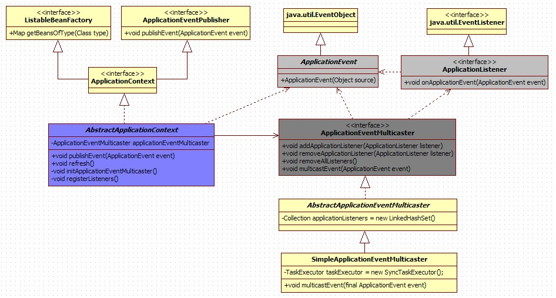

# spring事件驱动模型的结构

　　 

# spring提供的类的概念

## ApplicationEvent

```java
public abstract class ApplicationEvent extends EventObject {
    private static final long serialVersionUID = 7099057708183571937L;
    private final long timestamp;
    public ApplicationEvent(Object source) {
        super(source);
        this.timestamp = System.currentTimeMillis();
    }
    public final long getTimestamp() {
        return this.timestamp;
    }
}
```

　　ApplicationEvent继承自jdk的EventObject，所有的事件都需要继承ApplicationEvent，并且通过source得到事件源。

该类的实现类ApplicationContextEvent表示ApplicaitonContext的容器事件。

## ApplicationListener

```java
public interface ApplicationListener<E extends ApplicationEvent> extends EventListener {
    void onApplicationEvent(E event);
}
```

　　ApplicationListener继承自jdk的EventListener，所有的监听器都要实现这个接口，这个接口只有一个onApplicationEvent()方法，该方法接受一个ApplicationEvent或其子类对象作为参数，在方法体中，可以通过不同对Event类的判断来进行相应的处理。

​	当事件触发时所有的监听器都会收到消息，如果你需要对监听器的接收顺序有要求，可以实现该接口的一个实现SmartApplicationListener，通过这个接口可以指定监听器接收事件的顺序。

## ApplicationContext

　　　事件机制的实现需要三个部分，事件源、事件、事件监听器；

在上面介绍的：

​	ApplicationEvent就相当于事件，描述发生了什么事情的对象 ；

​	ApplicationListener相当于事件监听器，监听到事件发生的时候，做一些处理 ；

​	这里的事件源说的就是ApplicaitonContext，事件的触发的地方 。

　　 ApplicationContext是spring中的全局容器，译过来是"应用上下文"的意思。它用来负责读取bean的配置文档，管理bean的加载，维护bean之间的依赖关系，可以说是负责bean的整个生命周期，再通俗一点就是我们平时所说的IOC容器。

 	Application作为一个事件源，需要显示的调用publishEvent方法，传入一个ApplicationEvent的实现类对象作为参数。每当ApplicationContext发布ApplicationEvent时，所有的ApplicationListener就会被自动的触发。

　　ApplicationContext接口实现了ApplicationEventPublisher接口，后者有一个很重要的方法:

```java
public interface ApplicationEventPublisher {
    void publishEvent(ApplicationEvent event);
}
```

　　我们常用的ApplicationContext都继承了AbstractApplicationContext，像我们平时常见的ClassPathXmlApplicationContext、XmlWebApplicationContex也都是继承了它；AbstractApplicationcontext是ApplicationContext接口的抽象实现类，在该类中实现了publishEvent方法

```java
public void publishEvent(ApplicationEvent event) {
        Assert.notNull(event, "Event must not be null");
        if (logger.isTraceEnabled()) {
            logger.trace("Publishing event in " + getDisplayName() + ": " + event);
        }
        getApplicationEventMulticaster().multicastEvent(event);
        if (this.parent != null) {
            this.parent.publishEvent(event);
        }
}
```

　　在这个方法中，我们看到了一个getApplicationEventMulticaster()。这就要牵扯到另一个类ApplicationEventMulticaster。

## ApplicationEventMulticaster

　　属于事件广播器，它的作用是把Applicationcontext发布的Event广播给所有的监听器。

　　在AbstractApplicationContext中有一个applicationEventMulticaster的成员变量，提供了监听器Listener的注册方法.

```java
public abstract class AbstractApplicationContext extends DefaultResourceLoader
        implements ConfigurableApplicationContext, DisposableBean {

　　private ApplicationEventMulticaster applicationEventMulticaster;
　　protected void registerListeners() {
        // Register statically specified listeners first.
        for (ApplicationListener<?> listener : getApplicationListeners()) {
            getApplicationEventMulticaster().addApplicationListener(listener);
        }
        // Do not initialize FactoryBeans here: We need to leave all regular beans
        // uninitialized to let post-processors apply to them!
        String[] listenerBeanNames = getBeanNamesForType(ApplicationListener.class, true, false);
        for (String lisName : listenerBeanNames) {
            getApplicationEventMulticaster().addApplicationListenerBean(lisName);
        }
    }
}
```


# demo

## 1. 建立事件类

该类继承ApplicationEvent

```java
public class TenantCreatedEvent extends ApplicationEvent {

    private TenantId tenantId;

    public TenantCreatedEvent(TenantId tenantId) {
        super(tenantId);
        this.tenantId = tenantId;
    }

}
```


## 2. 建立监听类

该类实现ApplicationListener接口

```java
public class TenantCreatedListener implements ApplicationListener<TenantCreatedEvent> {

    @Override
    public void onApplicationEvent(TenantCreatedEvent event) {
        System.out.println("Into TenantCreatedListener");
        System.out.println("Tenant Id is " + event.getTenantId().getId());
        event.toString();
    }

}
```


## 3. 创建一个事件发布器

该类实内部持有ApplicationContext对象，使用ApplicationContext的publishEvent方法发布事件。

```
public class Publisher {

    private static ApplicationContext applicationContext;

    public Publisher(ApplicationContext applicationContext) {
        this.applicationContext = applicationContext;
    }

    public static void publishEvent(ApplicationEvent event) {
        System.out.println("发布事件。。。" + event.getClass());
        applicationContext.publishEvent(event);
    }

}
```
## 4. 注册事件发布器和监听类

另外配置在spring配置文件和使用注解的方式也是一样的。此种方式的优点在于按需注入（多模块架构中），不依赖Spring的包扫描

```java
@Configuration
public class MulticasterConfiguration {

    @Bean
    public Publisher publisher(ApplicationContext applicationContext) {
        Publisher publisher = new Publisher(applicationContext);
        return publisher;
    }

    @Bean
    public TenantCreatedListener tenantCreatedListener() {
        return new TenantCreatedListener();
    }

}
```

## 5. 测试

```java
@RunWith(SpringRunner.class)
@SpringBootTest
public class MulticasterApplicationTest {

    @Test
    public void publish() {
        Publisher.publishEvent(new TenantCreatedEvent(new TenantId(123)));
    }

}
```


输出：

​	发布事件。。。

​	Into TenantCreatedListener

​	Tenant Id is 123

# 总结

　　spring的事件驱动模型使用的是 观察者模式

　　通过ApplicationEvent抽象类和ApplicationListener接口，可以实现ApplicationContext事件处理。

　　监听器在处理Event时，通常会进行判断传入的Event是不是自己所想要处理的，使用instanceof关键字

　　ApplicationEventMulticaster事件广播器实现了监听器的注册，一般不需要我们实现，只需要显示的调用applicationcontext.publisherEvent方法即可