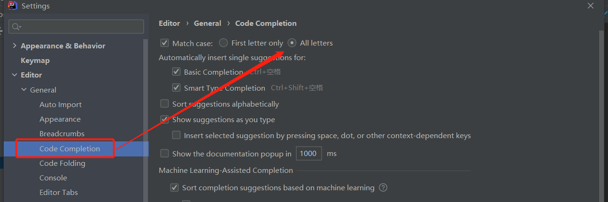
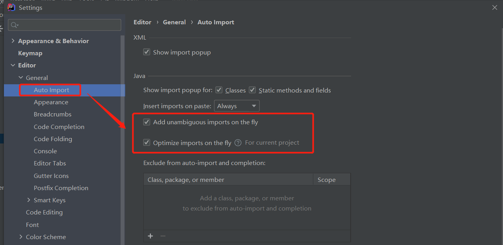
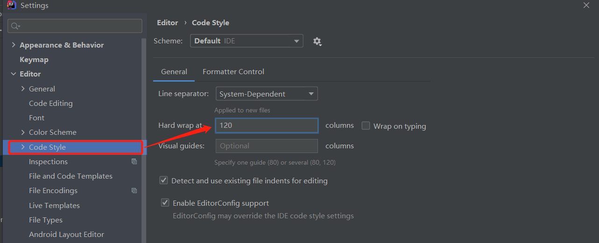
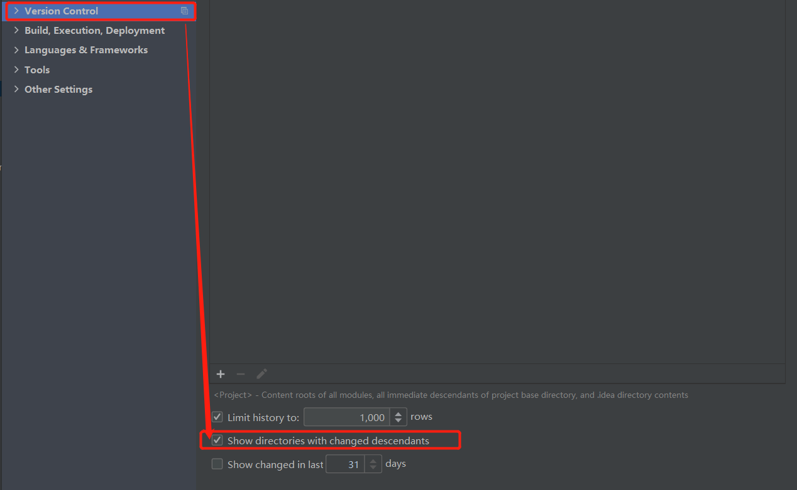
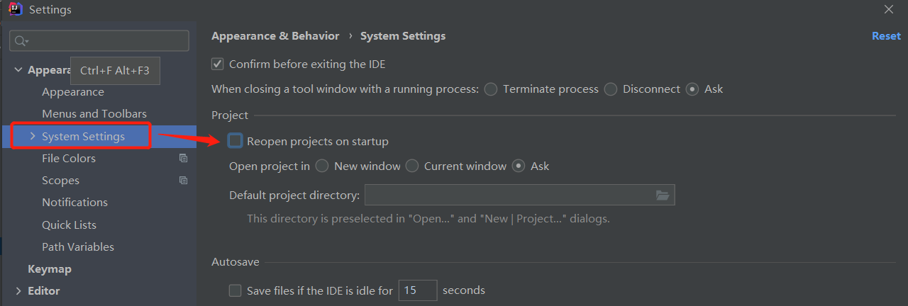

# IDEA启动命令行过长

```xml
项目的.idea/workspace.xml中配置
<property name="dynamic.classpath" value="true" />
```

# 基本设置

## 代码提示忽略大小写



## 自动导包



## 自动折叠代码行数



## 变更代码文件夹变色



## 取消打开软件时打开项目



# 常用快捷键

## 基本

切换标签页  Ctrl +　Tab  

关闭标签页   Ctrl + F4 

全屏        Ctrl + shift +  F12 

切换到项目栏      Alt  +  1 

查看类属性和函数  ALT +  7 

编辑批量          alt + 左键


大小写切换  ctrl +  shift +u 

## 代码补全

补全返回值  .val

补全分号   ctrl + shift + enter

补全if语句  boolean.if

补全while语句  boolean.while

万能补全语句  ctrl + alt + T

## 查找&移动

跳转到上一个方法：alt + up

跳转到下一个方法：alt + dn

移动代码：shift + alt+ 上下键  （光标在方法声明上，方法间移动）

光标回到上一次未知：ctrl + alt  + 左右键 

查找最近编辑的文件：ctrl + e

向下查找： ctrl + L

向上查找： ctrl + shift + L

## 重构

重命名文件、方法、属性等（Rename）：Shift+F6

提取当前选择为变量（Extract Variable）：Ctrl+Alt+V

提取当前选择为类的私有属性（Extract Field）：Ctrl+Alt+F

提取当前选择为常量（Extract Constant）：Ctrl+Alt+C

提取当前选择为方法（Extract Method）：Ctrl+Alt+M

提取当前选择为方法参数（Extract Parameter）：Ctrl+Alt+P

提取代码块至 if、try 等结构中（Surround With）：Ctrl+Alt+T

创建模块文件等（New）：Ctrl+Alt+N

创建测试用例（Test）：Ctrl+Shift+T

重构菜单（Refactor for this）：Ctrl+T

英雄总是最后登场！重构一切的男人！！！：Ctrl+Shift+Alt+T